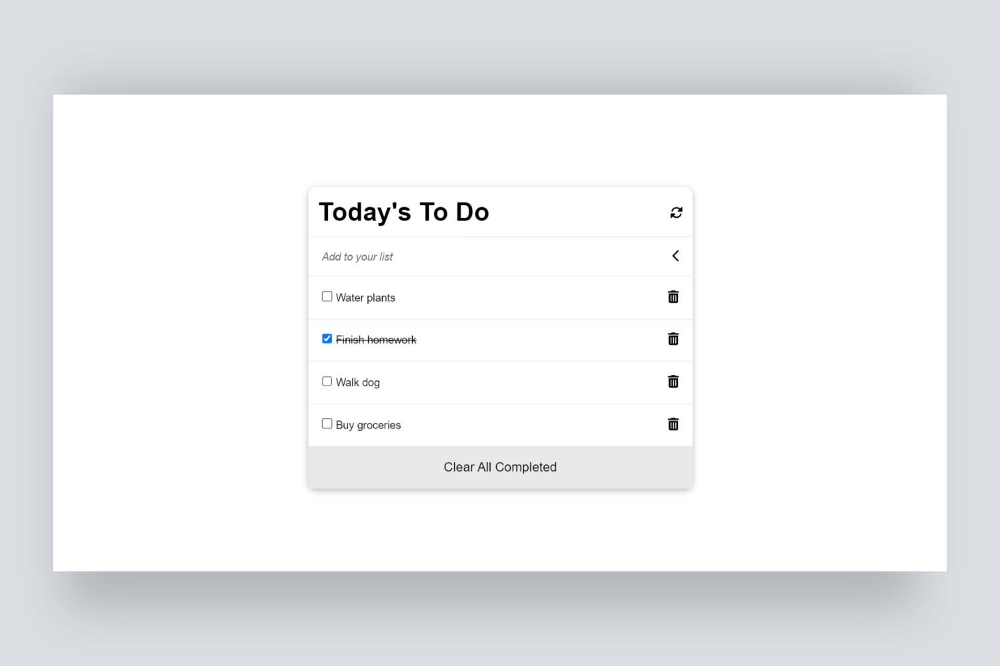

# To Do List
> A simple to-do-list. The user can add, delete, or edit a task. They can also remove all completed tasks. This web page was built using webpack and served by a webpack dev server.

## Preview

## Live Demo

[Live](https://shyusu4.github.io/To-Do-List/dist/)

## Built with

- HTML/CSS
- JavaScript
- Webpack

## Getting Started

- Clone the repo `git@github.com:shyusu4/To-Do-List.git`
- cd `into` the project
- Run `git pull origin app`
- Run `yarn install` or `npm install` to install dependencies
- On the terminal run `npm run start` open up the live server
- To run tests write `npm run test` on the terminal

## Authors

👤 Shakhrizoda Yusupova

- GitHub: [@shyusu4](https://github.com/shyusu4)
- Twitter: [@shyusu4](https://twitter.com/shyusu4)
- LinkedIn: [Shakhrizoda Yusupova](https://www.linkedin.com/in/shyusu4/)

👤 Degisew Mengist
- GitHub: [degisew](https://github.com/degisew)
- Twitter: [@DJ_etiya](https://twitter.com/@DJ_etiya)
- LinkedIn: [jegisew21](https://www.linkedin.com/in/degisew-mengist-390098219)

## 🤝 Contributing
Contributions, issues, and feature requests are welcome!

Feel free to check the [issues page.](https://github.com/shyusu4/To-Do-List/issues)

## Show your support
Give a ⭐️ if you like this project!

## Acknowledgments

Microverse

## 📝 License

This project is [MIT](https://github.com/shyusu4/To-Do-List/blob/main/MIT.md) licensed.
